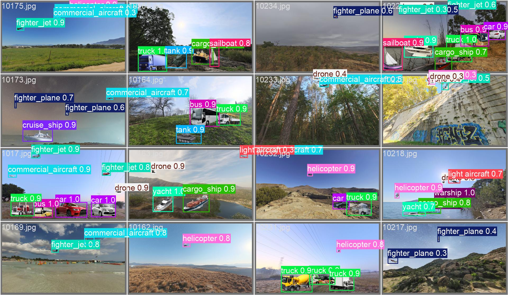

# Computer Vision (CV) Challenge - Data Chefs @ TIL-25 Hackathon



Welcome to the Computer Vision (CV) challenge repository for **Team Data Chefs** from the DSTA BrainHack TIL-AI 2025! This repository (`TimSeah/til-25-data-chefs-CV`) houses the code, Jupyter notebooks, models, and scripts we developed to tackle the object detection task.

The primary language used here is Python, with a significant portion of development and experimentation conducted in Jupyter Notebooks.

## 📝 Challenge Description

The objective of the CV challenge was to detect, locate, and classify 18 specific classes of objects (vehicles, vessels, aircraft) within complex image frames. The target classes were: `cargo_aircraft`, `commercial_aircraft`, `drone`, `fighter_jet`, `fighter_plane`, `helicopter`, `light aircraft`, `missile`, `truck`, `car`, `tank`, `bus`, `van`, `cargo_ship`, `yacht`, `cruise_ship`, `warship`, and `sailboat`.

## 🔗 Repository Links

*   **This Repository:** [TimSeah/til-25-data-chefs-CV](https://github.com/TimSeah/til-25-data-chefs-CV)
*   **Main Team Repository:** For an overview of our entire TIL-25 Hackathon project and other challenges, please visit [TimSeah/til-25-data-chefs](https://github.com/TimSeah/til-25-data-chefs).

## 💻 Key Technologies We Used

*   **Python:** Our primary language for scripting and model training.
*   **Jupyter Notebooks:** Extensively used for experimentation, data preprocessing, model training, and visualization.
*   **Ultralytics YOLOv8:** The core framework for our object detection model. We specifically utilized the `yolov8n-p2.yaml` architecture.
*   **PyTorch:** The backend deep learning library for YOLOv8, enabling GPU acceleration.
*   **OpenCV (`opencv-python`):** For image loading, preprocessing, and various image manipulation tasks.
*   **YAML:** For dataset and model configuration files.
*   **NumPy:** For numerical operations, especially with image data and bounding boxes.
*   **PowerShell & Shell Scripts:** For automating dataset preparation, training runs, and file management.
*   **Matplotlib & Pillow:** For image visualization and manipulation during development.

## ✨ Our Solution & Key Achievements

Our strategy for the CV challenge centered on training a robust YOLOv8 model tailored to the 18 specified classes. The development process involved several key stages:

### 1. Dataset Preparation
We organized our image data into `train/` and `val/` sets, with corresponding label files in YOLO format. A crucial configuration file, `yolo_18_classes_config.yaml`, was generated by our training script to define dataset paths (defaulting to `./yolo_dataset_output/`) and the 18 class names.

### 2. Model Selection & Configuration
We opted for the `yolov8n-p2.yaml` variant of YOLOv8, aiming for an optimal balance between detection performance and inference speed, presumably suitable for the competition's P2 performance tier. Our standard input image size was set to 640x640 pixels.

### 3. Hyperparameter Tuning
Before final training, we utilized YOLOv8's built-in tuning capabilities (`model.tune()`) via our `train_yolo_model.py` script. This process ran for 200 iterations, focusing on maximizing the mAP (mean Average Precision) score. The tuned hyperparameters (including learning rate, momentum, and various augmentation settings like `hsv_h`, `fliplr`, `mosaic`) were then used for the final, extended training run.

Tuning runs and their outputs were saved under the `YOLOv8_P2_Tuning/` project directory. 

### 4. Training Pipeline (`train_yolo_model.py`)
Our core training logic is encapsulated in the `train_yolo_model.py` script. Key aspects of this pipeline include:
*   **Consolidated Script:** It handles hyperparameter tuning, training, and validation.
*   **Custom Callbacks:** During training (defaulted to 300 epochs), we implemented custom callbacks to monitor progress, estimate remaining time, and periodically save backup model weights (e.g., every 20 epochs as defined by `EXPORT_INTERVAL`).
*   **Weighted Dataloader (Experimental):** The script includes an optional `YOLOWeightedDataset` class designed to potentially address class imbalance by adjusting sampling probabilities. This could be enabled by uncommenting a line in the script.
*   **Project Structure:** Training outputs, including models and logs, are saved under the project name `My_YOLOv8_18Class_P2_Project` and run name `train_run_final`.

### 5. Validation
We used the `model.val()` function, integrated into our training script, to evaluate our trained models on the designated validation set. Our primary metric of focus was mAP50-95.

### 6. Final Model
The best performing model checkpoint from our comprehensive training run (using the tuned hyperparameters) is saved as `best.pt`. This was the model intended for submission.

## 🚀 Training the Model

The primary script for all operations is `train_yolo_model.py`.

### Prerequisites
Ensure you have the necessary libraries installed:
```bash
pip install torch ultralytics onnx onnxruntime matplotlib opencv-python Pillow pyyaml --quiet
```

### Configuration within `train_yolo_model.py`:
*   **`YOLO_DATASET_ROOT_PATH`**: Path to your dataset (default: `./yolo_dataset_output`). Ensure this directory contains `train/images/`, `train/labels/`, `val/images/`, `val/labels/`.
*   **`MODEL_VARIANT`**: YOLOv8 model architecture (default: `yolov8n-p2.yaml`).
*   **`IMAGE_SIZE`**: Input image size (default: `640`).
*   **`BATCH_SIZE`**: Adjust based on your GPU VRAM (default: `8`).
*   **`EPOCHS`**: Number of training epochs (default: `300`).
*   **`EXPORT_INTERVAL`**: Frequency of saving backup models (default: `20` epochs).
*   **Control Flags**:
    *   `SHOULD_TUNE`: Set to `True` to run hyperparameter tuning. The script will then exit, requiring you to copy the suggested hyperparameters into the `hyperparams` dictionary in the script for the main training run.
    *   `SHOULD_TRAIN`: Set to `True` to run the main model training (default).
    *   `SHOULD_VALIDATE`: Set to `True` to validate an existing model.

### Running the script:
```bash
python train_yolo_model.py
```

### Model Output:
*   **Best Model:** The best performing model from training is saved at:
    `My_YOLOv8_18Class_P2_Project/train_run_final/weights/best.pt`
*   **Periodic Backups:** Intermediate models are saved during training (e.g., `epoch_20.pt`, `epoch_40.pt`) in the same `weights` directory.
*   **Tuning Results:** Hyperparameter tuning outputs are saved under `YOLOv8_P2_Tuning/tune_run_final/`.

This iterative process of dataset preparation, hyperparameter tuning, training with custom callbacks, and rigorous validation allowed us to develop our best possible YOLOv8 model for the challenge.
